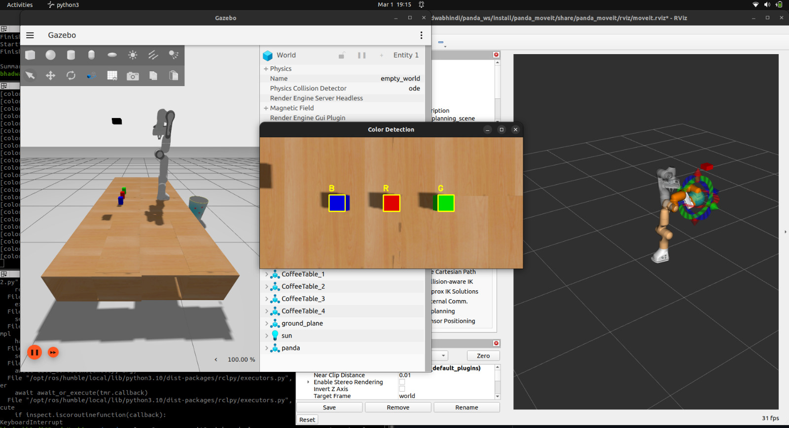
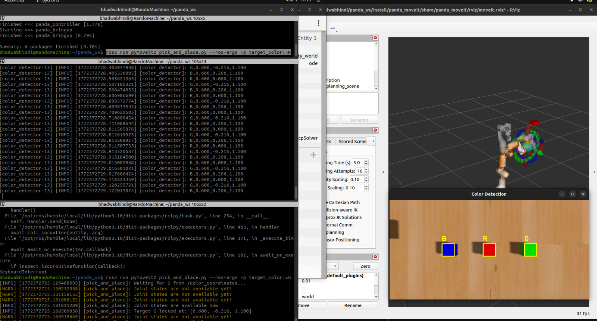

# Panda Color Sorting System (ROS 2)

This project is an intelligent color sorting system built on **ROS 2**, powered by the **Franka Emika Panda** robotic arm. It integrates **OpenCV** for computer vision, **MoveIt 2** for motion planning, and **Gazebo** for simulation, enabling autonomous pick-and-place operations for colored objects.

---

## Features

* Real-time detection of red, green, and blue objects using OpenCV
* Advanced motion planning and trajectory execution with MoveIt 2
* Fully autonomous pick-and-place operation with gripper control
* Ability to switch target colors dynamically without restarting
* Visual feedback through RViz for motion planning and execution

---

## Folder Structure

* **panda_bringup** – launch files and robot initialization
* **panda_controller** – robot control nodes
* **panda_description** – URDF, meshes, and robot description files
* **panda_moveit** – MoveIt 2 configuration and motion planning
* **panda_vision** – color detection and image processing nodes
* **pymoveit2** – Python-based MoveIt 2 examples
* **.gitignore** – ignores build artifacts, editor files, etc.

---

## Quick Start

1. **Build the ROS 2 workspace**

```bash
cd ~/panda_ws
colcon build
```

2. **Source the workspace**

```bash
source ~/panda_ws/install/setup.bash
```

3. **Launch the simulation**

```bash
ros2 launch panda_bringup pick_and_place.launch.py
```

4. **Run the Python pick-and-place node**

```bash
source ~/panda_ws/install/setup.bash
ros2 run pymoveit2 pick_and_place.py --ros-args -p target_color:=R
```

> Replace `R` with `G` or `B` to sort different colored objects.

---

## Screenshots

**Gazebo simulation of the Panda arm:**



**Pick-and-place operation in RViz:**



---

## Notes

* Only source code and configuration files are included. Build and log directories are ignored.
* Designed for ROS 2 Humble, but can be adapted for other ROS 2 distributions.
* Works in Gazebo simulation; minor adjustments may be needed for real hardware.

---


## Acknowledgements

* **Franka Emika Panda** – robotic arm
* **ROS 2** and **MoveIt 2** – robotics framework
* **OpenCV** – computer vision

---

